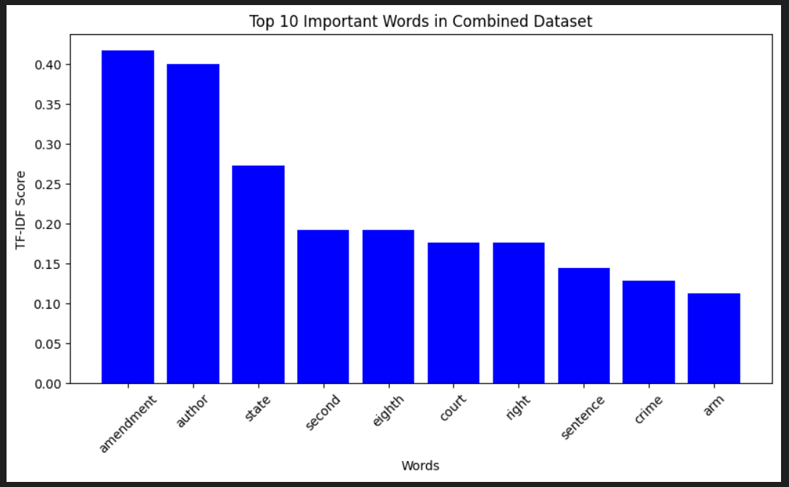
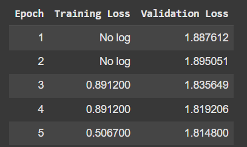

# Paralegal Advisor

### Introduction ⚖️
Paralegals navigate an overwhelming number of documents and past cases to find information strengthening their argument. Their responsibilities of conducting research and organizing facts can be streamlined using a combination of question answering (QA) and sentiment analysis.  

#### Our Vision 👀
Our goal was to minimize the overhead involved during legal research. We aim to provide legal experts with a tool that allows them to gather information efficiently.

### Overview
- Question Answering: User provides case document and a prompt such as "Why was the accused charged with death penalty?" Returns extracted answer from the case document.
- Semantic Search: User provides case overview. Returns most similar past cases using MongoDB's vector search index.
- Sentiment Analysis: Classifies a piece of text as positive or negative based on the words used. Positive label represents a won case and negative label represents a lost case.

Bonus (Future Implementation):
- Contextual Summarization: Examines a case to highlight key arguments established and reference to applicable laws. 

### Dataset 📚
QA: Legal Dataset
Sentiment Analysis: Stanford IMDB Dataset

### Methodology 🎯
Data Ingestion: web scrape, Kaggle/HF dataset imports
Preprocessing: text normalization, stopword removal, punctuation removal, HTML tag removal
Visualizations: Pie-Chart, Bar Graphs, Line Graphs, Word Cloud
Transformers Used: BERT, RoBERTa, DistilBERT
Statistical Models Used: Decision Tree and Random Forest

### Findings 📊
- Manipulating the duplicate words within the data for Question answering helped the model avoid returning repetitive words within it's extracted answer.
- RoBERTa had the highest F1 and EM scores for Question Answering. Then, DistilBERT and BERT, respectively.
- Most to all of the cases were labelled with Negative for sentiment analysis.
- It was difficult for the IMDB trained transformers to conclude the case sentiment based on the words in the case text. This was due the high usage of negative words in the text. 

#### TF-IDF

#### Question Answering:
BERT

DistilBERT

RoBERTa

#### Sentiment Analysis:

DistilBERT

BERT

